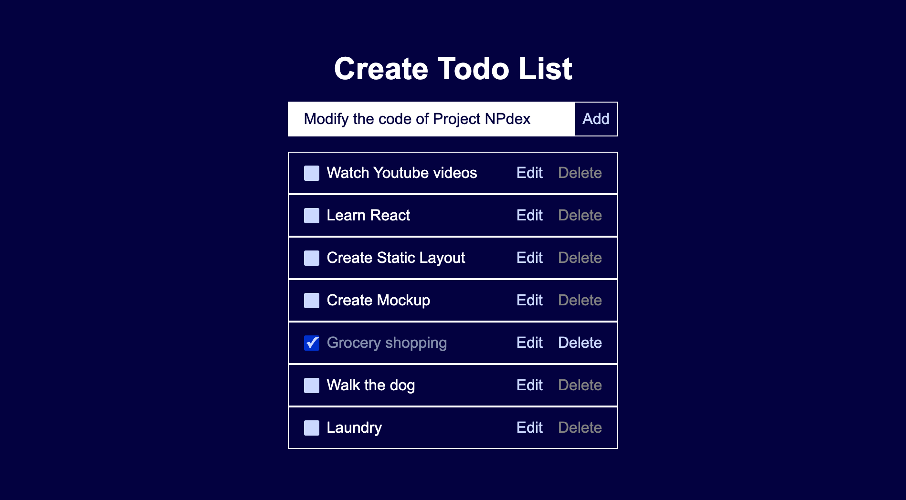
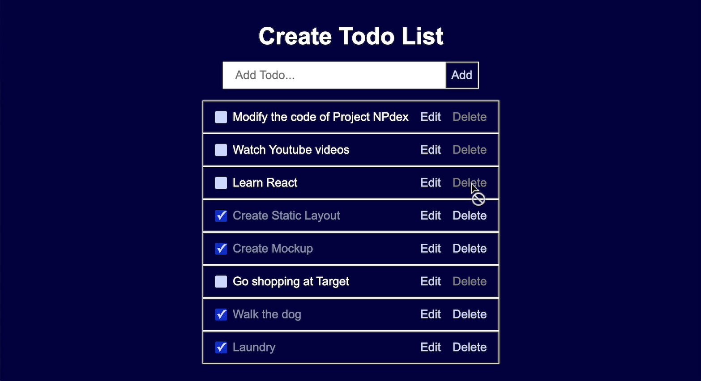
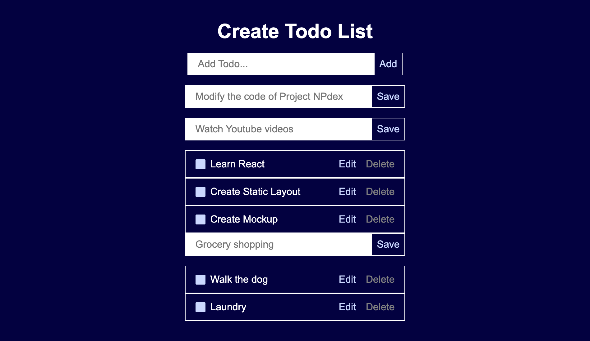

# Todo List Application

This is a simple todo list application built using React. It allows users to add, edit, toggle, and delete todo items. The application utilizes React hooks such as useState and useEffect to manage state and handle side effects.

## Features

- Add new todo items: Users can add new todo items to the list.
- Edit todo items: Users can edit existing todo items.
- Mark todos as completed: Users can mark todos as completed by clicking on the checkbox next to each todo.
- Delete todo items: Users can delete todo items from the list. The "delete" button is disabled unless the todo is complete.
- Local Storage: Todos are stored in the browser's local storage, so they persist even after the browser is refreshed.

### Components

### App.jsx

The main component of the application. It manages the state of todo items and renders other components such as NewTodoForm and TodoList. It provides functions to add, toggle, edit, and delete todos, and to manage state and local storage.

### NewTodoForm.jsx

A component for adding new todo items. It provides a form for users to input new todo items.

### EditTodoForm.jsx

A form component for editing existing todos. It consists of an input field populated with the current todo's title and a button to save the changes.

### TodoList.jsx

A list component that displays the todos. It maps over the todos array and renders TodoItem components for each todo. Also handles the rendering of EditTodoForm when a todo is being edited.

### TodoItem.jsx

Represents a single todo item. Displays the todo title, a checkbox to mark it as completed, an edit button to edit the todo, and a delete button to delete the todo. The delete button is disabled if the todo is not completed.

### AppReducer.jsx and the files in the components-reducer folder

`AppReducer.jsx` is the main component of the application.  
These files uses the useReducer hook to manage state and dispatch actions to update the state based on the defined reducer function. Manages the state of todos and provides functions to add, toggle, edit, and delete todos. Uses useState and useEffect hooks for managing state and local storage.
